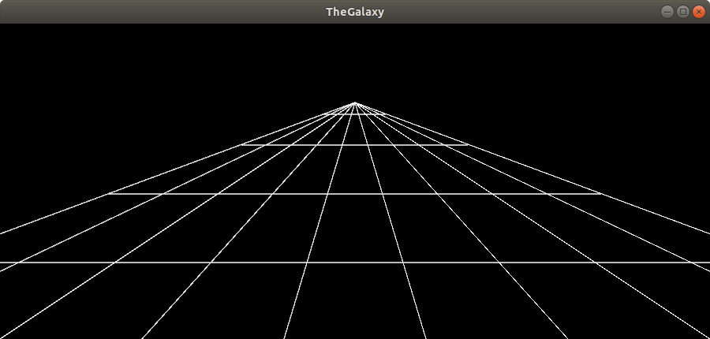
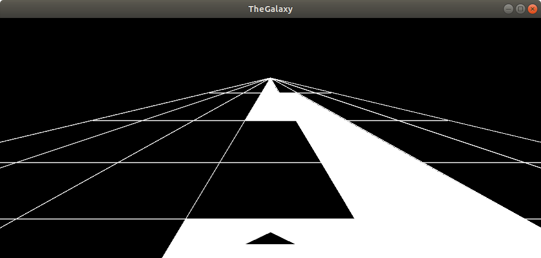
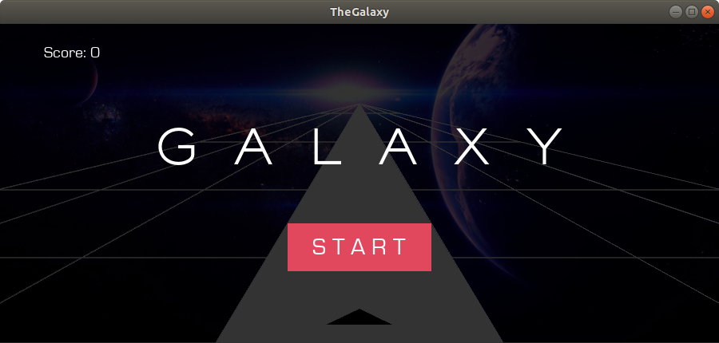
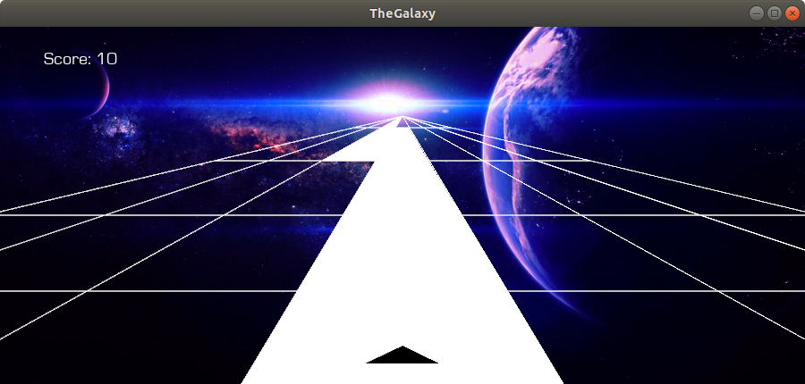
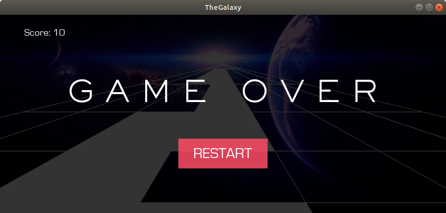
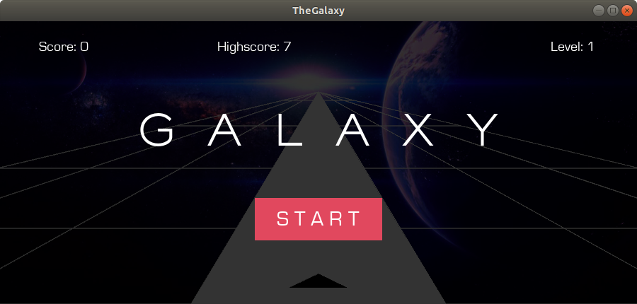
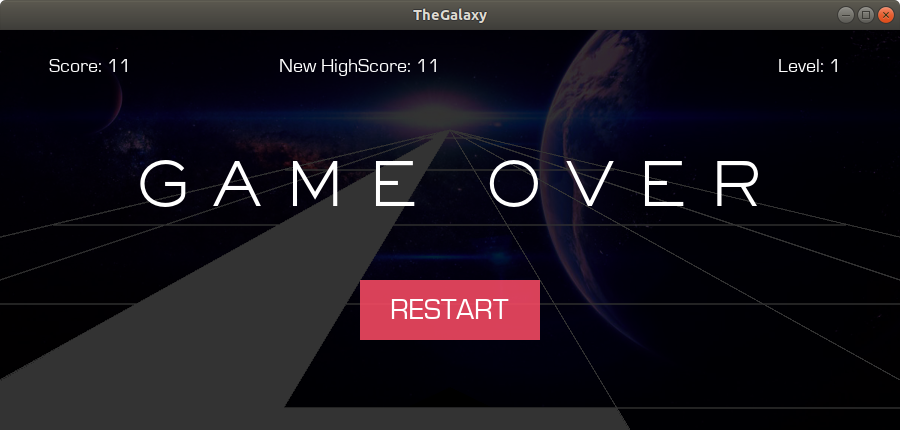

**The Galaxy**
-
The goal of this project is to pilot a spaceship through the galaxy. For this purpose, an automatically generated path is to be followed. 
In the first finished version there should only be a score.

**Version01** 

In the first version, the grid is created in which the path should run. In addition, the grid is made movable to the right and left, so that it looks as if the spaceship follows the path afterwards.
On the computer the arrow keys can be used. On the cell phone you can use touch on the right and left side.

**Version02**

In the second version it is possible to follow the track with the space shuttel. There is no game over yet (only via output on the computer in the terminal).

**Version03**

In this Version you will be able to play the Game.
Please note! In Android kivy NO *.jpg can be embedded. Therefore, be sure to switch to *.png!

We have now more directories. I added "audio", "fonts" and "images". In "images" you only need *.png. As audio files *.wav are used.
In addition, the new folders must be included in buildozer.spec.
+ source.include_patterns = assets/*,images/*.jpg,audio/*.wav, fonts/*.ttf
+ source.include_exts = py,png,jpg,kv,atlas,ttf,wav
I have excluded some directories, because I would like to build an APK only with contents of "Main".
+ source.exclude_dirs = tests, bin, venv, TheLab, Source, Galaxy

Version 3 is completed.

**Version04**

As the last function for now, levels and high score will be integrated. Levels will be displayed in the upper right corner of the screen. The speed will be increased at a score of +50 (score module 50 equals 0).

